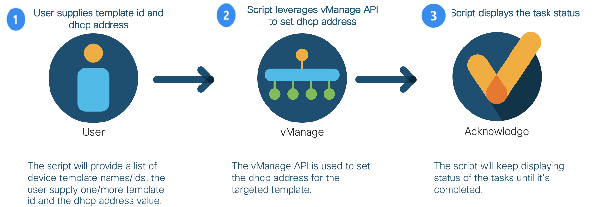

# GVE DevNet SD-WAN Device Template Variable Update
This script allows for adjusting the DHCP helper address as a variable in SD-WAN device templates.

## Contacts
* Stien Vanderhallen
* Roaa Alkhalaf

## High-level Overview



## Solution Components
* SD-WAN
* vManage

## Installation/Configuration

**NOTE:** The expected script output as listed below is based on the [Cisco SD-WAN 19.2 DevNet Sandbox](https://devnetsandbox.cisco.com/RM/Diagram/Index/c9679e49-6751-4f43-9bb4-9d7ee162b069?diagramType=Topology). 

The following commands are executed in the terminal.

1. Create and activate a virtual environment for the project:
```
#WINDOWS:
 $ py -3 -m venv sdwan_dhcp_helper
 $ source sdwan_dhcp_helper/Scripts/activate

 #MAC:
 $ python3 -m venv sdwan_dhcp_helper 
 $ source sdwan_dhcp_helper/bin/activate
 ```
 > For more information about virtual environments, please click [here](https://docs.python.org/3/tutorial/venv.html)
 
 2. Access the created virtual environment folder
 ``` 
 $ cd sdwan_dhcp_helper
 ```
 3. Clone this repository
 
 ```
 $ git clone https://wwwin-github.cisco.com/gve/gve_devnet_sdwan_dhcp_helper_template.git
 ```
 4. Access the folder gve_devnet_sdwan_dhcp_helper_template
 ```
 $ cd gve_devnet_sdwan_dhcp_helper_template
 ```

5. Install the dependencies:
```
$ pip install -r requirements.txt
 ```

6. Open the .env file and add the following environment variables:

- ```VMA_HOST``` : The IP address of your vManage instance  <br> 
- ```VMA_USER``` : Your vManage username  <br> 
- ```VMA_PASS``` : Your vManage password

## Usage

1. To run the script, type the following command in your terminal:

```
$ python3 main.py
```  

2. Select your targeted device template from the list of templates you get displayed the script by entering its identifier.

```
------
Template Name: vSmart_Template
Template ID: 90f26d2d-8136-4414-84de-4e8df52374e6
------
Template Name: Site_1_and_2_cEdge_Template
Template ID: c566d38e-2219-4764-a714-4abeeab607dc
------
Template Name: Site_3_vEdge_Template
Template ID: db4c997a-7212-4ec1-906e-ed2b86c3f42f
------
Template Name: DC_cEdge_Template
Template ID: 24d4be69-8038-48a3-b546-c6df199b6e29
------
Enter template id/ ids separated by a space: 
```

3. Enter the new DHCP helper address you want to configure.

```
------
Template Name: vSmart_Template
Template ID: 90f26d2d-8136-4414-84de-4e8df52374e6
------
Template Name: Site_1_and_2_cEdge_Template
Template ID: c566d38e-2219-4764-a714-4abeeab607dc
------
Template Name: Site_3_vEdge_Template
Template ID: db4c997a-7212-4ec1-906e-ed2b86c3f42f
------
Template Name: DC_cEdge_Template
Template ID: 24d4be69-8038-48a3-b546-c6df199b6e29
------
Enter template id/ ids separated by a space: 24d4be69-8038-48a3-b546-c6df199b6e29
Enter the new dhcp address: 1.2.3.4
```

4. Monitor the progress of your device template update. If succesfull, the script shows an output similar to the following: 

```
------
DHCP helper setting status is "in_progress" - Response: {
  "action": "push_feature_template_configuration",
  "name": "Push Feature Template Configuration",
  "detailsURL": "/dataservice/device/action/status",
  "startTime": "1650540186512",
  "endTime": "0",
  "userSessionUserName": "admin",
  "userSessionIP": "192.168.254.11",
  "tenantName": "DefaultTenant",
  "total": 1,
  "status": "in_progress",
  "count": {
    "Scheduled": 1
  }
}
------
DHCP helper setting status is "in_progress" - Response: {
  "action": "push_feature_template_configuration",
  "name": "Push Feature Template Configuration",
  "detailsURL": "/dataservice/device/action/status",
  "startTime": "1650540186998",
  "endTime": "0",
  "userSessionUserName": "admin",
  "userSessionIP": "192.168.254.11",
  "tenantName": "DefaultTenant",
  "total": 1,
  "status": "in_progress",
  "count": {
    "In progress": 1
  }
}
------
DHCP helper setting status is "in_progress" - Response: {
  "action": "push_feature_template_configuration",
  "name": "Push Feature Template Configuration",
  "detailsURL": "/dataservice/device/action/status",
  "startTime": "1650540186998",
  "endTime": "0",
  "userSessionUserName": "admin",
  "userSessionIP": "192.168.254.11",
  "tenantName": "DefaultTenant",
  "total": 1,
  "status": "in_progress",
  "count": {
    "In progress": 1
  }
}
------
DHCP helper setting status is "done" - Response: {
  "action": "push_feature_template_configuration",
  "name": "Push Feature Template Configuration",
  "detailsURL": "/dataservice/device/action/status",
  "startTime": "1650540186998",
  "endTime": "1650540201722",
  "userSessionUserName": "admin",
  "userSessionIP": "192.168.254.11",
  "tenantName": "DefaultTenant",
  "total": 1,
  "status": "done",
  "count": {
    "Done - Scheduled": 1
  }
}
```


### LICENSE

Provided under Cisco Sample Code License, for details see [LICENSE](LICENSE.md)

### CODE_OF_CONDUCT

Our code of conduct is available [here](CODE_OF_CONDUCT.md)

### CONTRIBUTING

See our contributing guidelines [here](CONTRIBUTING.md)

#### DISCLAIMER:
<b>Please note:</b> This script is meant for demo purposes only. All tools/ scripts in this repo are released for use "AS IS" without any warranties of any kind, including, but not limited to their installation, use, or performance. Any use of these scripts and tools is at your own risk. There is no guarantee that they have been through thorough testing in a comparable environment and we are not responsible for any damage or data loss incurred with their use.
You are responsible for reviewing and testing any scripts you run thoroughly before use in any non-testing environment.
